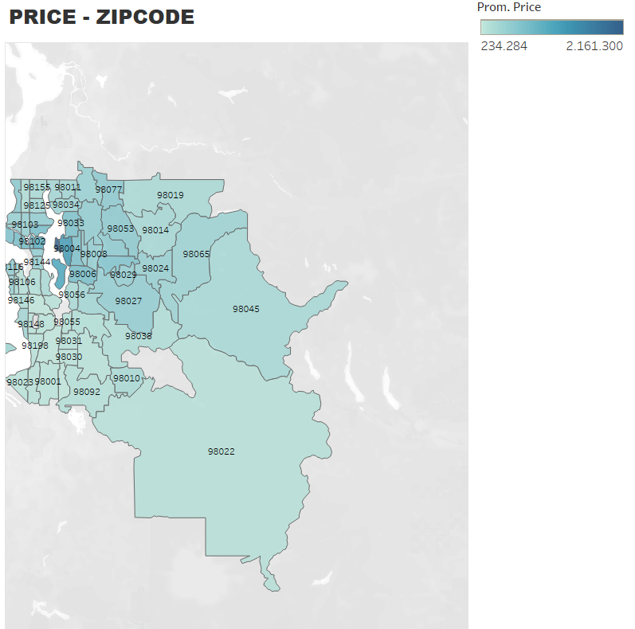

# MID-PROJECT - REAL ESTATE.

**.-Introduction:**
  

As an introductory part, let me provide some context about the objective of this project. We were tasked with generating a model capable of predicting real estate property prices using Business Intelligence. Additionally, we were required to identify and understand the factors responsible for determining the prices of properties with values higher than $650,000.

We were provided with a database containing historical real estate transactions between the years 2014 and 2015, comprising approximately 22,000 properties.
  

**.-Exploration and Data Preparation:**
  

As a first step in exploring the database, I imported the Excel file into a Python notebook and analyzed the DataFrame's size, which was 21,597 x 21. All columns were in numeric format (int64 and float64), and one column was in dateTime format. The database contained no missing values.

Next, I iterated through each column to visualize the distribution of the data, providing a preliminary understanding of the data structure. None of the columns showed a normal distribution. After studying the variable distributions, I analyzed their correlations and observed that "sqft_living" and "sqft_above" had a correlation of 0.88, making them the two variables with the highest correlation. However, I decided not to eliminate any variables at this point.

I then focused on the "date" variable, plotting a scatter-plot to check for any trends. However, as it did not contribute much information and did not show any relevant trends, I decided to omit this variable from my analysis.

With the initial exploratory analysis complete, I determined that the data was in an acceptable condition. I proceeded to normalize the numeric variables and ran a first test model using linear regression, obtaining an R2 value of 0.69. Additionally, I performed K-Nearest Neighbors (KNN) with 4 reference neighbors, resulting in an accuracy score of 0.31 and an MSE of 89383897890.31117. I created a graph to visualize the relationship between accuracy and the number of neighbors (K), showing that 4 neighbors would be the "ideal" number, although the accuracy did not exceed 0.32.

Given these results, I decided to delve deeper into data cleaning and variable treatment.

  

2nd Cleaning and Preparation:
  

In this second stage, I examined the unique values of each variable and identified an outlier in the "bedroom" variable, where one property had 33 bedrooms. I decided to remove this outlier from the dataset. Additionally, I eliminated the "ID" variable as it was expressed as a number and was not practical to work with as either a numeric or categorical variable.

I treated the "Grade" and "Condition" variables as ordinal categorical variables and assigned appropriate categories to them. I used the "yr_built" and "yr_renovated" variables to calculate the age of each property by subtracting the last recorded year in the DataFrame (2015) from the construction year. If a property had undergone renovation, I calculated the difference with the last recorded year instead of the construction year. This resulted in a new variable representing the age of each property.

The variables "Waterfront," "View," and "Zipcode" were treated as categorical variables, and I generated dummy variables for each of them. Lastly, since the "Price" (dependent variable) exhibited an exponential distribution, I applied a logarithmic transformation to reduce its magnitude. I also dropped the variables that were not going to be introduced into the model.

With all these changes implemented, I decided to scale all variables except for "price," which had already undergone logarithmic transformation.

  

**.- Model Application**
  

Regression with "Price_log"

After all the changes and treatments made to the DataFrame, I decided to run a second linear regression in which I obtained an R2 of 0.874.

Analyzing the behavior of the variables in the model, the following can be highlighted:
  

| Variable        | Coefficient | p-value | Std Error |
|-----------------|-------------|---------|-----------|
| sqft_above      | 1.1653      | 0.000   | 0.021     |
| grade_ordinal   | 0.9433      | 0.000   | 0.021     |
| sqft_living     | 0.8984      | 0.000   | 0.016     |
| waterfront_1    | 0.4499      | 0.000   | 0.019     |
| view_3          | 0.1669      | 0.000   | 0.009     |
| zipcode_98039   | 1.0466      | 0.000   | 0.037     |
  

According to the results of the regression with all significant variables, these are the ones with the highest coefficients and, therefore, would explain the dependent variable. It is important to note that when interpreting the coefficients, the price is expressed in logarithm, so the coefficient should be read as a percentage.
  

Regression with "grade_ordinal"

Continuing the analysis, I observed that the "grade_ordinal" variable has a significant weight in the model. Therefore, I focused on it and tried to analyze it further. I used it as the dependent variable in a new linear regression model to understand which variables affect this housing grade.
  

In this model, I obtained a lower R2 of 0.761.

| Variable       | Coefficient | p-value | Std Error |
|----------------|-------------|---------|-----------|
| sqft_living    | 0.1991      | 0.000   | 0.005     |
| sqft_above     | 0.2811      | 0.000   | 0.007     |
| bedrooms       | -0.2982     | 0.000   | 0.017     |
| diff_yr_built  | -0.1101     | 0.000   | 0.003     |
  

With this second regression, I managed to determine the variables that explain the housing grades. It was observed that "sqft_living" and "sqft_above" again show a high coefficient, while "bedrooms" and "diff_yr_built" have a negative relationship, indicating that a lower number of bedrooms and more recent construction years lead to a higher grade.
  
  

**.- Analysis of Properties with Price above $650,000.**
  

For this new line of analysis, I filtered my DataFrame to only include properties with prices above $650,000. This resulted in a DataFrame with 5205 rows.

I decided to continue using the linear regression model for this analysis, but this time, I did not use the price expressed in logarithm; instead, I used its original magnitude.
  

**.- Conclusion**
  

In conclusion, this project successfully developed predictive models and analyzed the factors influencing property prices. It was found that the size of the property, its quality (grade), the presence of waterfront views, and the views themselves are essential elements in explaining prices both in general and for properties with higher values. The obtained results can provide valuable insights for real estate agents and buyers interested in understanding the pricing and characteristics that most affect the real estate market under study. However, further research and model improvements are recommended, as well as considering additional factors that may influence property prices in a broader context.

  

**Exploratory Data Analysis in SQL:**

Another essential aspect of the project was the analysis of the database using SQL. The objective was to answer specific questions posed by the Real Estate company.

First, I created a table in MySQL and then imported the database, ensuring careful data type control during the data ingestion process. Once the table was set up with its corresponding columns and assigned values, I began the analysis.

-The first question was to determine the unique values for the variables bedrooms, bathrooms, floors, condition, and grade.
  

Bedrooms: 3, 2, 4, 5, 6, 1, 7, 8, 9, 11, 10, 33.

Bathrooms: 1, 2.25, 3, 2, 4.5, 1.5, 2.5, 1.75, 2.75, 5, 3.25, 3.5, 6.75, 4.25, 0.75, 4, 3.75, 5.75, 8, 7.5, 7.75, 6.25, 6.5, 1.25, 5.25, 6, 4.75, 0.5, 5.5.

Floors: 1, 2, 3, 4.

Condition: 1, 2, 3, 4, 5.

Grade: 3, 4, 5, 6, 7, 8, 9, 10, 11, 12, 13.

  

-The second request is a ranking of the 10 most expensive properties:

| ID   | PROPERTY_ID  | PRICE   |
|------|--------------|---------|
| 7375 | 6762700020   | 7700000 |
| 3882 | 9808700762   | 7060000 |
| 9949 | 9208900037   | 6890000 |
| 4513 | 2470100110   | 5570000 |
| 1253 | 8907500070   | 5350000 |
| 1162 | 7558700030   | 5300000 |
| 959  | 1247600105   | 5110000 |
| 8021 | 1924059029   | 4670000 |
| 2483 | 7738500731   | 4500000 |
| 9572 | 3835500195   | 4490000 |

  
-The average price of all properties in the database is: AVERAGE_PRICE : '540296.57'
  

-The average price of properties based on the number of bedrooms is as follows:

| Bedrooms | Average_price |
|----------|---------------|
| 1        | 318239.46     |
| 2        | 401387.75     |
| 3        | 466276.59     |
| 4        | 635564.68     |
| 5        | 786874.13     |
| 6        | 825853.50     |
| 7        | 951447.82     |
| 8        | 1105076.92    |
| 9        | 893999.83     |
| 10       | 820000.00     |
| 11       | 520000.00     |
| 33       | 640000.00     |

  

-The average living area (sqft_living) of properties based on the number of bedrooms is as follows:

| Bedrooms | Average_sqft_living |
|----------|--------------------|
| 1        | 888.15             |
| 2        | 1239.75            |
| 3        | 1805.84            |
| 4        | 2554.65            |
| 5        | 3047.55            |
| 6        | 3284.34            |
| 7        | 3974.21            |
| 8        | 3800.00            |
| 9        | 3775.00            |
| 10       | 3706.67            |
| 11       | 3000.00            |
| 33       | 1620.00            |

  

-Average price based on Waterfront (0 = No, 1 = Yes):

| waterfront | Average_price |
|------------|---------------|
| 0          | 531762.32     |
| 1          | 1662524.18    |

  

-Correlation analysis between Condition and Grade shows no correlation between the two variables, as the increase or decrease in one variable does not positively or negatively affect the other:

| house_condition | AVG(grade) |
|-----------------|------------|
| 1               | 59.655     |
| 2               | 65.412     |
| 3               | 78.273     |
| 4               | 73.826     |
| 5               | 73.210     |

  
-A property meeting the specified characteristics is identified:

Number of bedrooms: 3 or 4

Bathrooms: more than 3

Floors: one floor

Waterfront: no waterfront

Condition: at least 3

Grade: at least 5

Price: less than 300000

Identified property: ID: 1791, property_id: 7316400070.

A list of all properties with prices double the average value of all properties in the database is obtained, and a view is created for the query. There are 1246 properties that meet this price criterion.
  

-Comparison of average prices between properties with 3 and 4 bedrooms:

| bedrooms | avg_price | avg_price_4_bedrooms | price_difference |
|----------|-----------|----------------------|------------------|
| 3        | 466276.59 | 635564.68           | 169288.09        |

  

-Number of different locations with available properties:

I count the ZIP codes and find a total of 70 different locations where properties are available for sale.

  
-List of renovated properties:

As a result, there are a total of 914 properties that have been renovated.

  
-Lastly, they request the identification of the property that ranks 11th in the list of the most expensive properties.
  

The property identified is ID: 12742, property_ID: 6065300370, Price: $4,210,000.

  

ANALYSIS AND VISUALIZATIONS WITH TABLEAU.

As the final part of the project, we were tasked with creating visualizations that graph the interaction between variables to identify key patterns, trends, and relationships that affect property prices and their quality.

In general, the conclusions drawn from the visualizations indicate that variables such as waterfront, view, and grade tend to have higher average prices as they increase.
  

Average price grouped by house condition.

  

Average price grouped by Squarefeet above.
  

Average price grouped by view quality of the property.

  

Average price grouped by zipcode.